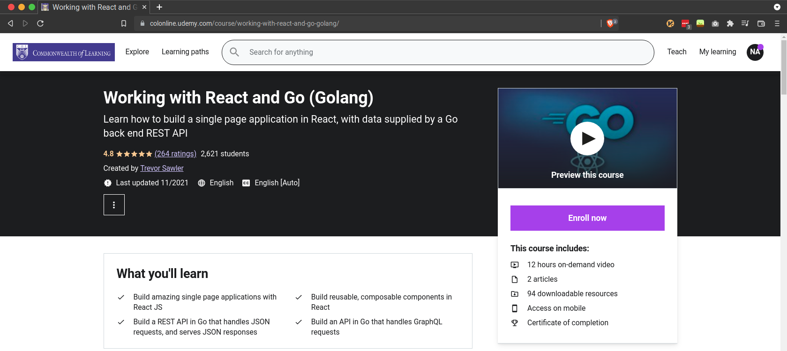
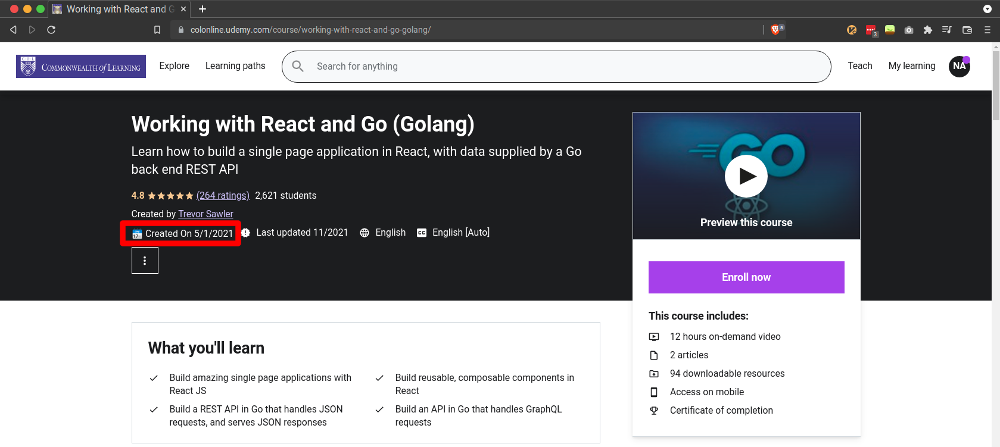
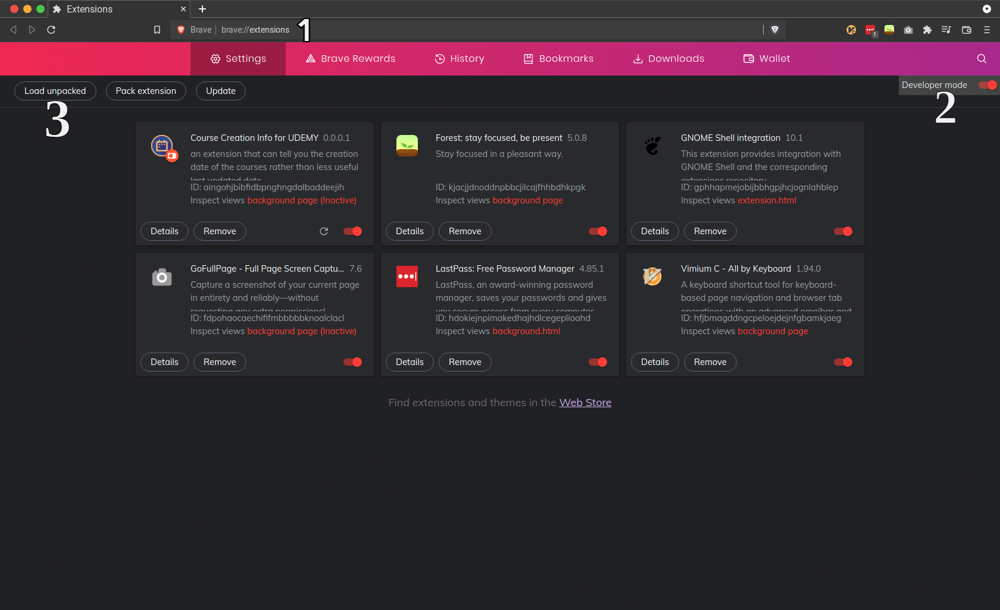

## What it Does
This plugin will show the course creation date of any udemy course by fetching the data via udemy's API. (will work for "https://colonline.udemy.com/", domain also 😉 )

### **Before**

### **After**

 

## How to Install Locally on CHROME OR BRAVE
 

1. click code and click download zip to download this repo.
2. extract the zip file anywhere you like.
2. Open Brave/Chrome and navigate to the extensions page.
3. Make sure "Developer mode" is enabled.
4. Click "Load unpacked extension" button, browse the headless-recorder/dist directory and select it.

 

